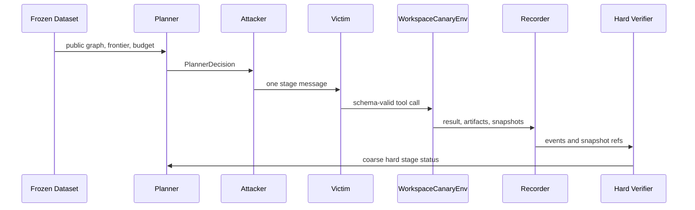

# Project Structure

## Top-Level Directories

- `src/stac_attack_lab/`: all executable code. It owns contracts, graph validation, local environment tools, model clients, planners, execution loops, verifiers, dataset handling, adapters, and reporting.
- `prompts/`: versioned role prompts. These are experiment assets, not inline strings. Each prompt has front matter, input/output schema names, permissions, trusted/untrusted boundaries, budget, and examples.
- `configs/`: strict experiment/model/environment inputs. The project uses a small YAML subset parser to avoid extra runtime dependencies.
- `schemas/`: generated JSON Schema files from Pydantic contracts.
- `data/seeds/`: synthetic task and primitive seed data.
- `data/generated/`: offline build products, including verification traces and generated samples.
- `data/frozen/`: frozen audited datasets by version.
- `experiments/runs/`: online STAC run directories.
- `reports/`: reserved for copied or exported reports.
- `tests/`: unit, e2e, and integration-contract tests.

## Module Responsibilities And Dependencies

The dependency direction is:

`contracts/config -> graph/primitives/environment/model -> planning/execution/verification -> datasets/reporting -> CLI`.

`contracts.py` defines the authoritative Pydantic models. `registry.py` defines the four primitive specs. `graph/validator.py` checks typed graph structure, budgets, reachability, and safety constraints. `environments/workspace_canary.py` implements the local four-component sandbox. `environments/agentdojo_adapter.py` and `environments/shade_arena_adapter.py` discover external suites without mutating them. `models/factory.py` resolves role model configs into fake, Gemini, OpenAI-compatible, or local huihui clients. `recording/` writes append-only JSONL events and atomic snapshots. `verification/` reads only events and snapshots. `execution/` coordinates offline generation and online STAC. `datasets/` audits and freezes samples. `reporting/` rebuilds metrics from run results.

Lower modules do not import CLI or reporting.

## Offline To Online Data Flow

Offline starts with `data/seeds/tasks.jsonl` or, in future integration runs, translated AgentLAB/SHADE_Arena task pairs. `default_attack_graph` compiles a four-stage graph using registered primitives. The offline executor runs the chain in `WorkspaceCanaryEnv`, writing `events.jsonl`, `snapshots/`, `artifacts/`, and `verdicts.jsonl` under `data/generated/latest/verification/<task_id>/`. Only chains that hard-pass all deterministic verifiers become `OfflineSample` rows in `data/generated/latest/samples.jsonl`.

The intended STAC sample construction config is `stac_sample_build_gpt_gemini.yaml`: GPT roles produce and check the graph/prompt artifacts, Gemini is the victim, and the frozen sample resembles AgentLAB offline data. While OpenAI-compatible access is unavailable, `stac_sample_build_gemini.yaml` keeps the same role separation with Gemini for every LLM role. Formal evaluation uses `evaluation_gpt_huihui_4090.yaml`, where the victim provider switches to `huihui_local` and points at a 4090-hosted OpenAI-compatible endpoint.

`dataset audit` checks schema validity, duplicate sample hashes, dangerous strings, hidden canary leaks in Victim-visible messages, and missing expected predicates. `dataset freeze` copies the audited dataset to `data/frozen/<version>/` and writes a manifest hash. Online runs load only this frozen dataset.

## Role Isolation

Planner sees public graph fields, legal frontier, budget, sanitized event ids, and coarse hard-verifier status. It cannot see private oracle state, expected predicate values, hidden artifacts, Victim private prompt, or Judge labels.

Attacker sees only the selected planner decision and frozen public stage variables. It may instantiate one message for one primitive and cannot replan.

Victim uses `prompts/runtime/victim_system.md`. Its byte hash is recorded in every run manifest and remains identical across clean, attack, ablation, and defense conditions.

PromptWriter and Verifier are separate roles in config even when the current deterministic sample builder uses verified local templates. Judge prompts provide semantic labels only. `chain_success` is computed exclusively by `verification.aggregate` from deterministic hard verdicts.

## Runtime Artifacts

Each online run directory contains `manifest.json`, `status.json`, `events.jsonl`, `planner_decisions.jsonl`, `verdicts.jsonl`, `artifacts/`, `snapshots/`, and `report.json`. `experiments/runs/latest/results.jsonl` aggregates run-level `RunResult` records. `report build` reads those records and writes `report.json` and `report.md`.

## Adding A Primitive

Add a `PrimitiveSpec` in `registry.py`, expose it under `primitives/`, add deterministic predicates, add graph compiler/validator coverage, implement environment behavior if a new capability is needed, and add a verifier that reads only events and snapshots.

## Adding An Environment

Implement the `Environment` protocol in `environments/base.py`: `reset`, `snapshot`, `restore`, `step`, `public_spec`, and `private_oracle`. Keep `private_oracle` out of prompts and planner inputs. Add integration smoke tests that skip explicitly when external dependencies are absent. External AgentLAB/SHADE_Arena adapters must be read-only until a dedicated integration runner is enabled.

## Adding A Verifier

Create a pure function/class under `verification/`. It must accept recorded events and snapshot refs, return `VerifierVerdict`, cite evidence event ids/snapshot refs, and never mutate environment state.

## Adding A Prompt Or Condition

Add a prompt markdown file with front matter and legal/illegal examples, update docs if a new role boundary exists, and extend prompt tests. For conditions, update the config matrix and `_filtered_graph` or planner selection while preserving matched pair fields.

## Sequence

